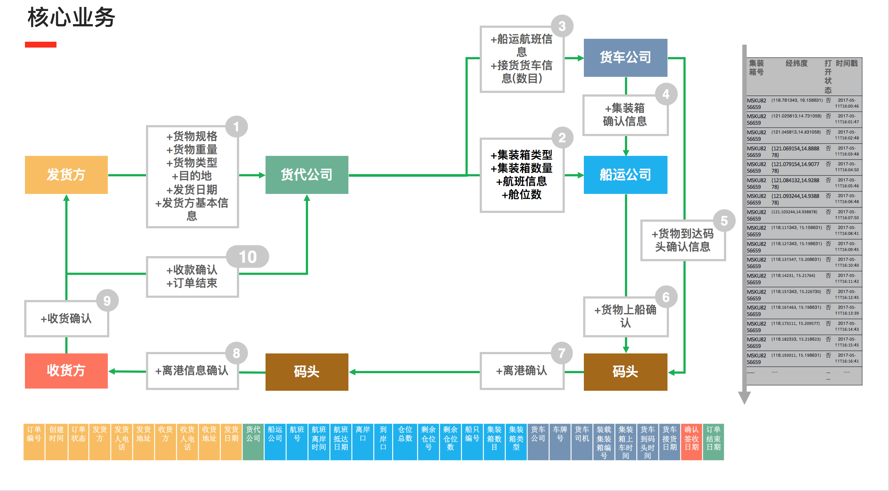

# Introduction
The project app-container was the source code of the Blockchain-based Container and Order Management System proposed by Team 03 XingYunLiuShui (行云流水). 
There are mainly three parts, the chaincode, the service and the console. The latent blockchain platform we used is fabric.

- [chaincode](./chaincode): This part defines the logical rules on how to process the shipping orders and how to manage the resources, like containers and vehicles.
- [service](./service): The service is destined to encapsulate the details of dealing with the latent blockchain. The rest service is written in Golang.
- [console](./console): This part provides a web console to provide orders for clients, cargo agents, vehicle companies and shipping companies.
                        The web front end is based on the AngularJS framework.

## Chaincode
The chaincode is composed of three modules, a.k.a. user module, resource module and order module. The overall life circle of a shipping order is show as follow.

## Service 

### REST API

Use [swagger online editor][1] and import the configuration file [swagger.yaml](swagger.yaml) which defined the RESTful APIs,
then you can refer to the details on the APIs.

## Console
The console is essentially a single-page application, obeying the MVC (Model-View-Controller) principles. 
The source code of the console could be found in the directory `console/block-paltform-console/src/app`.

[1]: http://editor.swagger.io/#/ "swagger online editro"
